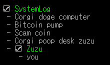

Corgi-The-Logger
====
__DogShit logger for C#.__<br>

* Foldable (Depth-based categorizing)
* Interact with MouseInput!
* Animation & Coloring


UNDER DEVELOPMENT<br>

<br>

```csharp
using Corgi;

// auto foldable
var TAG = "SystemLog";
Logger.Write(TAG, "Corgi got fever");
Logger.Write(TAG, "Corgi got dogecoin");
Logger.Write(TAG, "Doge got corgi");

// two-depth
var TAG2 = "SystemLog/Zuzu";
Logger.Write(TAG2, "bought dogecoin");
```
